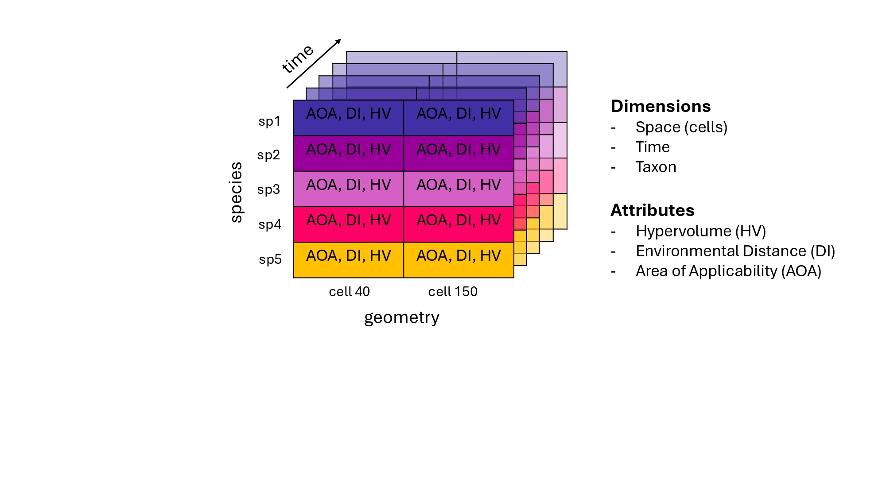

# Suitability Cube 
The **Suitability Cube (SC)** is a reproducible, multidimensional structure designed to critically evaluate the outcomes of species distribution models (SDMs) in relation to the environmental data on which they are built. By organizing information across space, time, and taxa, the SC links species occurrence records with environmental predictors within a unified analytical framework, allowing a more transparent assessment of habitat suitability patterns and model reliability.

SC incorporates measures of environmental distance, which quantify how different the environmental conditions at prediction sites are from those represented in the training data. This allows identifying where model projections are environmentally supported and where they involve extrapolation into unfamiliar conditions. It also integrates metrics of niche breadth (derived from hypervolumes) to describe the ecological space occupied by each species and the Area of Applicability (AOA) to delineate the environmental domain within which model predictions can be considered valid.

By integrating these components, the SC provides a coherent system for comparing species and time periods, highlighting environmentally uncertain regions, and identifying where models can be meaningfully interpreted. Ultimately, the Suitability Cube enhances the critical evaluation of SDMs by linking what the model predicts to where those predictions should be trusted, fostering more transparent, reproducible, and ecologically grounded modelling practices. 

## Key concepts 
* **Hypervolume (HV)**: it represents a species’ ecological niche as an n-dimensional region defined by environmental variables, following the concept introduced by Hutchinson (1957). Each axis corresponds to an independent and ecologically relevant factor, such as temperature or precipitation, and the resulting hypervolume encompasses all combinations of conditions under which the species can persist.
* **Environmental Distance (Dissimilarity Index, DI)**: It quantifies how different the environmental conditions at a prediction site are from those represented in the training (occurrence) data. Following the method of Meyer & Pebesma (2021), DI is computed as a standardized distance in a multidimensional predictor space that has been (i) standardized, (ii) weighted by variable importance, and (iii) expressed relative to typical distances between training samples. This provides a unitless, comparable measure of environmental novelty
* **Area of Applicability (AOA)**: the Area of Applicability (AOA) defines the spatial domain where model predictions can be considered environmentally supported by the training data. It is computed directly from the Dissimilarity Index (DI) and provides a binary, spatially explicit assessment of whether a prediction site lies inside or outside the environmental space represented during model training (Meyer & Pebesma 2021).

## Conceptual workflow 
The conceptual workflow underlying the Suitability Cube (SC) consists of 4 main phases: **data acquisition**, **pre-processing**, **indicator computation**, and **cube building**. The workflow is organized into sequential, reproducible steps that ensure a coherent progression from data acquisition to cube construction while remaining flexible enough to accommodate different user needs and modelling contexts.
1. **Data download**. In the first stage, the necessary input data are collected and harmonized: the **national boundary**, **bioclimatic predictors** and **species occurrence data**.
To reduce collinearity among predictors, a correlation-based variable selection is performed on the present dataset, and the same subset of variables is applied to future scenarios to maintain temporal consistency.
2. **Pre-processing**. Following data acquisition, environmental and occurrence datasets are cleaned and harmonized. 
3. **Indicators**. This phase focuses on deriving three diagnostic indicators (HV, DI, AOA) that form the informational core of the Suitability Cube. All of them are computed from the same environmental predictors and occurrence data used to train the SDMs, ensuring consistency between model inputs and their evaluation.
4. **Cube building**. This phase integrates all indicators into a unified, three-dimensional structure that organizes information across space, species, and time.

<p align="center">
  <br>
  <em> Workflow</em>
</p>


The final output is a **three-dimensional data cube** (cell × species × time) that integrates all indicators derived from SDM inputs. This cube provides a reproducible and transparent framework for exploring how species occupy environmental space, identifying areas of high uncertainty or extrapolation, and evaluating the robustness of model predictions through space and time.

<p align="center">
  <br>
  <em> Final output with the 3 dimensions </em>
</p>


## Installation

You can install the development version of suitabilitycube from GitHub with:

```r
install.packages("remotes")
remotes::install_github("b-cubed-eu/suitabilitycube")
```
Then load the package: 
```r
library(suitabilitycube)
```


## Example

### Setup
This configuration defines the spatial, temporal, and taxonomic parameters used throughout the workflow.
```r
## 1. User inputs (EDIT here)
params <- list(
  species      = c("Bufo bufo", "Bufotes viridis", "Bombina variegata"),
  country_name = "Italy",
  country_iso  = "IT",
  res_arcmin   = 2.5,
  ssp_code     = "245",
  gcm_model    = "BCC-CSM2-MR",
  period       = "2041-2060",
  outdir       = tempdir(),      # change to a persistent path if desired
  gbif_years   = c(2010, 2020),
  gbif_limit   = 20000,
  cor_thr      = 0.7,
  cor_frac     = 0.10,
  grid_cellsize_deg = 0.25,      # ~25 km
  grid_square      = FALSE       # FALSE = hex, TRUE = square
)
```
### Data download
Bioclimatic variables for the present period were downloaded from WorldClim, while those for the future were retrieved from CMIP6 for the selected Global Circulation Model (BCC-CSM2-MR), scenario (SSP245), and time window (2041–2060).  Both datasets were downloaded at a spatial resolution of 2.5′ (~5 km). 

After download, each dataset was cropped and masked to the national boundary of Italy, retrieved with ```geodata::gadm()```. To guarantee spatial comparability, the present raster stack was aligned to the future using the custom helper function ```align_to()```, which resamples the data to a common extent, resolution, and coordinate reference system. 

Following alignment, a correlation-based variable selection was applied to the present bioclimatic dataset to reduce multicollinearity among predictors. Pairwise correlations were computed on a 10% random sample of grid cells, and variables exceeding a threshold of ```r > 0.7``` were iteratively removed using the custom function ```drop_high_corr()```. 

The resulting subset of predictors, ```bio3```, ```bio4```, ```bio8```, ```bio11```, ```bio14```, and ```bio16```, was retained as the final set of environmental variables. The same subset was then applied to the future dataset to ensure temporal consistency.

Species occurrence records were retrieved from GBIF using the R package ```rgbif```:
* Three amphibians: Bufo bufo, Bufotes viridis, Bombina variegata) 
* Country = IT, 
* Years = 2010–2020, 
* Record cap = 20,000 per species.


```r
# country boundary
country_vec <- geodata::gadm(params$country_name, level = 0, path = params$outdir)

# present bioclimatic predictors
bio_present <- geodata::worldclim_country(
  country = params$country_name, var = "bio", res = params$res_arcmin, path = params$outdir
) |> terra::crop(country_vec) |> terra::mask(country_vec)

# future bioclimatic predictors
bio_future <- geodata::cmip6_world(
  model = params$gcm_model, ssp = params$ssp_code, time = params$period,
  var = "bio", res = params$res_arcmin, path = params$outdir
) |> terra::crop(country_vec) |> terra::mask(country_vec)

# align_to aligns a raster stack to a target grid (bilinear)
bio_present_aligned <- align_to(bio_present, bio_future)

## 2. Variable selection (on PRESENT)
cor_res   <- drop_high_corr(bio_present_aligned, thr = params$cor_thr, frac = params$cor_frac)
cmat      <- cor_res$cor
vars_keep <- cor_res$selected
vars_drop <- cor_res$dropped

# align names (do this once right after creating bio_future)
names(bio_future) <- names(bio_present_aligned)

# keep same variables in the future
bio_present_sel <- bio_present_aligned[[vars_keep]]
bio_future_sel  <- bio_future[[vars_keep]]

## 3. GBIF occurrences --------------------------------------------------------
occ_list <- gbif_occ_list(params$species, params$country_iso, params$gbif_years, params$gbif_limit)

```
<p align="center">
  <br>
  <em> Climatic variables </em>
</p>
<p align="center">
  <br>
  <em> Occurrences </em>
</p>


### Hypervolume
In this workflow, the hypervolume is empirically estimated from observed species occurrences and their associated environmental predictors. The computation is performed using the R package ```hypervolume``` (Blonder et al., 2018), which applies a Gaussian kernel density estimation (KDE) method (```hypervolume_gaussian```) to model the probability density of species occurrences in environmental space. The hypervolume is computed only for the present period, as it depends on empirical occurrences that are not available for future conditions and could be affected by dispersal limitations or niche shifts.

* ```extract_predictors_at_points```: extracts raster values at point locations, keeps only selected predictor variables, removes rows with missing values, and drops numeric predictors with zero variance.
* ```z_transform```: numeric columns are standardized (mean 0, sd 1). Missing values are replaced with the column mean prior to standardization. Columns with zero variance become all zeros
* ```compute_global_bw```: uses ```hypervolume::estimate_bandwidth``` on the predictor matrix. Returns 1 if estimation fails or produces non-finite values.
* ```hyp_calc```: computes a Gaussian hypervolume using ```hypervolume::hypervolume_gaussian``` and returns the volume. Returns NA if there are insufficient unique points or if the computation fails.
* Wrapper loop: iterates over all species to compute individual hypervolume values for the present period

``` r
pred_vars_present <- names(bio_present_sel)
hv_by_species     <- setNames(vector("list", length(params$species)), params$species)

# hypervolume calculation
for (sp in params$species) {
  occ_sf <- occ_list[[sp]]
  if (is.null(occ_sf) || nrow(occ_sf) == 0) { hv_by_species[[sp]] <- NA_real_; next }
  train_df  <- extract_predictors_at_points(bio_present_sel, occ_sf, pred_vars_present)
  if (nrow(train_df) < (ncol(train_df)+1L)) { hv_by_species[[sp]] <- NA_real_; next }
  z_df <- z_transform(train_df)
  hv_by_species[[sp]] <- hyp_calc(z_df, compute_global_bw(z_df))
}

# output 
hv_by_species

# $`Bufo bufo`
# [1] 1728.868

# $`Bufotes viridis`
# [1] 1482.359

# $`Bombina variegata`
# [1] 1881.454
```
<p align="center">
  <br>
  <em> Hypervolume values </em>
</p>
### AOA and DI
A set of functions was implemented to automate the computation of DI and the AOA for each species. Some functions overlap with those used for hypervolume estimation, ensuring consistency across indicators.
* ```extract_predictors_at_points```: extracts environmental variable values from raster layers at species occurrence locations (also used in Hypervolume computation)
* ```z_transform```: standardizes environmental predictors to make them comparable across variables (shared with Hypervolume workflow)
* ```compute_aoa_pair```: computes the 	DI for both present and future environmental rasters using ```CAST::aoa()```, which simultaneously derives the DI and the corresponding AOA.
* Wrapper loop: iterates over all species to compute per-species DI and AOA values for the present and future periods, skipping species with insufficient training data.

```r
aoa_di_by_species <- setNames(vector("list", length(params$species)), params$species)

for (sp in params$species) {
  occ_sf <- occ_list[[sp]]
  if (is.null(occ_sf) || nrow(occ_sf) == 0) { aoa_di_by_species[[sp]] <- NULL; next }
  train_df <- extract_predictors_at_points(bio_present_sel, occ_sf, pred_vars_present)
  if (nrow(train_df) < 5 || ncol(train_df) < 1) { aoa_di_by_species[[sp]] <- NULL; next }
  aoa_di_by_species[[sp]] <- compute_aoa_pair(train_df, new_present = bio_present_sel, new_future = bio_future_sel)
}

# output of one species and one scenario
aoa_di_by_species$`Bufo bufo`$present

# DI:
# class       : SpatRaster 
# dimensions  : 278, 285, 1  (nrow, ncol, nlyr)
# resolution  : 0.04166667, 0.04166667  (x, y)
# extent      : 6.625, 18.5, 35.5, 47.08333  (xmin, xmax, ymin, ymax)
# coord. ref. : lon/lat WGS 84 (EPSG:4326) 
# source(s)   : memory
# varname     : wc2.1_2.5m_bioc_BCC-CSM2-MR_ssp245_2041-2060 
# name        :       DI 
# min value   : 0.000000 
# max value   : 2.289293 

# AOA:
# class       : SpatRaster 
# dimensions  : 278, 285, 1  (nrow, ncol, nlyr)
# resolution  : 0.04166667, 0.04166667  (x, y)
# extent      : 6.625, 18.5, 35.5, 47.08333  (xmin, xmax, ymin, ymax)
# coord. ref. : lon/lat WGS 84 (EPSG:4326) 
# source(s)   : memory
# varname     : wc2.1_2.5m_bioc_BCC-CSM2-MR_ssp245_2041-2060 
# name        : AOA 
# min value   :   0 
# max value   :   1 


# Predictor Weights:
#  wc2.1_30s_bio_3 wc2.1_30s_bio_4 wc2.1_30s_bio_8 wc2.1_30s_bio_11 wc2.1_30s_bio_14 wc2.1_30s_bio_16
# 1               1               1               1                1                1                1

# AOA Threshold: 0.1816886
```
<p align="center">
  <br>
  <em>  Environmental Dissimilarity Index (DI) and Area of Applicability (AOA) for Bufo bufo under present climatic conditions. Low DI values (blue) correspond to environments similar to those represented in the occurrence data, while high values (yellow) indicate increasing environmental dissimilarity. The AOA map highlights areas within and outside the model’s environmental domain. </em>
</p>

<p align="center">
  <br>
  <em> Environmental Dissimilarity Index (DI) and Area of Applicability (AOA) for Bufo bufo projected under future conditions (BCC-CSM2-MR, SSP245, 2041–2060).
The overall increase in DI and reduction of the AOA illustrate a decrease in environmental similarity between present and future conditions.
 </em>
</p>


### Cube building
This phase organizes all previously computed indicators, HV, DI and AOA, into a unified, multidimensional structure that enables consistent spatial, temporal, and taxonomic analysis. The resulting cube is implemented in R using the ```stars``` package, which supports multidimensional data aligned by space, time, and species. Custom functions developed for this workflow are: 
* ```as_stars_on_grid```: aggregates raster values to polygon grid cells and converts outputs to stars format
* ```build_metric_cube```: builds multi-dimensional stars cubes (AOA or DI) by aggregating indicators across species and time
* ```build_hv_cube```: generates the hypervolume cube by inserting scalar niche-size values per species
* ```merge_cubes```: combines all indicator cubes into a single multi-attribute data cube aligned by dimensions

The process is made by the following steps, that aim to reduce the dimensionality and compress all the information in a single, reproducible object: 
1. Define grid parameters
2. Download and prepare the country boundary
3. Build the spatial grid
4. Raster-to-grid aggregation
5. Aggregate indicators by cell, species and time
6. Integrate Hypervolume
7. Merge all indicators into a single multi-attribute cube 

```r
# inputs & grid params
species_vec  <- params$species
cellsize_deg <- params$grid_cellsize_deg
make_square  <- isTRUE(params$grid_square)

# country boundary (sf)
country_vec <- if (exists("prelim")) prelim$country_vec else geodata::gadm(params$country_name, 0, params$outdir)
country_sf  <- sf::st_as_sf(country_vec) |> sf::st_buffer(0)

# build the cell grid
grid_cells <- sf::st_make_grid(country_sf, cellsize = cellsize_deg,
                               what = "polygons", square = make_square) |>
  sf::st_as_sf() |>
  dplyr::mutate(cell = seq_len(dplyr::n()))
sf::st_crs(grid_cells) <- 4326

# keep only species that actually have AOA/DI
species_vec <- species_vec[species_vec %in% names(aoa_di_by_species) & !vapply(aoa_di_by_species, is.null, TRUE)]
stopifnot(length(species_vec) > 0)

AOA_cube <- build_metric_cube(
  aoa_di_by_species = aoa_di_by_species,
  species_vec = species_vec,
  grid_cells = grid_cells,
  metric = "AOA"
)

DI_cube <- build_metric_cube(
  aoa_di_by_species = aoa_di_by_species,
  species_vec = species_vec,
  grid_cells = grid_cells,
  metric = "DI"
)

## build HV cube (present only; NA in future), aligned to AOA/DI
dims  <- stars::st_dimensions(AOA_cube)   # reuse geometry + labels
shape <- dim(AOA_cube$AOA)                # c(n_cell, n_taxa, n_time)

# gather HV scalars in species order (missing species → NA)
hv_vals <- vapply(species_vec, function(sp) as.numeric(hv_by_species[[sp]]), numeric(1))
hv_arr  <- array(NA_real_, shape,
                 dimnames = list(NULL, dims$taxon$values, dims$time$values))
i_present <- match("present", dims$time$values)
for (j in seq_along(species_vec)) hv_arr[, j, i_present] <- hv_vals[j]

HV_cube <- stars::st_as_stars(list(HV = hv_arr), dimensions = dims)

## merge into final multi-attribute cube
data_cube <- c(AOA_cube, DI_cube, HV_cube)
data_cube <- stars::st_set_dimensions(data_cube, "taxon", values = species_vec)
data_cube <- stars::st_set_dimensions(data_cube, "time",  values = c("present","future"))

# sanity check
print(stars::st_dimensions(data_cube))
#       from   to refsys point                                                        values
# cell     1 2744 WGS 84 FALSE POLYGON ((6.487442 35.496...,...,POLYGON ((18.61244 46.971...
# taxon    1    3     NA    NA       Bufo bufo        , Bufotes viridis  , Bombina variegata
# time     1    2     NA    NA                                              present, future
```
### Output
The workflow produces a multi-attribute environmental data cube, implemented as a ```stars``` object in R.
The cube integrates the three indicators, Area of Applicability, Environmental Distance, and Hypervolume, into a single, coherent structure that supports spatial, temporal, and taxonomic analysis of model-related indicators.
The cube has three dimensions: ```cell```, ```taxon```, and ```time```, corresponding respectively to spatial grid units, species, and temporal steps (present and future). Each cell contains the computed attributes.

* **AOA** (binary): identifies areas within or outside the model’s environmental domain
* **DI** (continuous): quantifies how distant local environmental conditions are from those represented in the training data
* **HV** (scalar per species): describes the niche breadth, available only for the present period
```r
# stars summary (concise)
print(data_cube)
# stars object with 3 dimensions and 3 attributes
# attribute(s):
#              Min.     1st Qu.       Median         Mean      3rd Qu.       Max.  NA's
# AOA  0.000000e+00    0.000000    0.0000000    0.2378368    0.0000000    1.00000 11490
# DI   1.331202e-02    0.264708    0.4212397    0.4879698    0.6308022    3.31862 11490
# HV   1.482359e+03 1482.359428 1728.8683041 1697.5604886 1881.4537340 1881.45373  8232
# dimension(s):
#       from   to refsys point                                                        values
# cell     1 2744 WGS 84 FALSE POLYGON ((6.487442 35.496...,...,POLYGON ((18.61244 46.971...
# taxon    1    3     NA    NA       Bufo bufo        , Bufotes viridis  , Bombina variegata
# time     1    2     NA    NA                                              present, future 
```

<p align="center">
  <br>
  <em> Visualization of the multi-attribute environmental cube (data_cube), showing the AOA for the three amphibian species (Bufo bufo, Bufotes viridis, Bombina variegata) across present (top) and future (bottom) climatic conditions.
Each hexagonal cell represents a spatial unit of the analysis grid, with yellow cells indicating areas within the model’s environmental domain (AOA = 1) and blue cells denoting extrapolated or environmentally unsupported areas (AOA = 0).
 </em>
</p>

### Basic usage
This multidimensional structure allows the exploration, visualization, and comparison of ecological indicators across locations, species, and time, while maintaining full alignment between environmental and spatial data. Some ways the data cube can be used. 
#### Locate a cell for a given coordinate
Identifies which grid cell a given geographic coordinate belongs to and displays it on a map for visual inspection.
``` r
# Define a point (lon, lat) in EPSG:4326
pt <- st_sf(geometry = st_sfc(st_point(c(12.5, 42.5)), crs = 4326))

# Which grid cell contains the point?
which_cell <- suppressWarnings(st_join(pt, grid_cells, join = st_intersects))
if (is.na(which_cell$cell)) {
   message("❌ This point is NOT within the study area.")
 } else {
   cell_id <- which_cell$cell
   message(sprintf("✅ Point falls inside cell #%d", cell_id))
 }

# ✅ Point falls inside cell #1361
```
<p align="center">
  <br>
  <em> Identification of the grid cell containing the coordinate (12.5°E, 42.5°N). The background shows the bioclimatic variable bio, with the green point marking the queried location and the orange hexagon indicating the selected cell (#1361) that contains it.
 </em>
</p>

#### Basic introspection and slice
Examine the cube’s organization, dimensions, and extent, enabling the inspection of selected indicators or specific subsets.
``` r
# Spatial extent of the cube (bbox of all cells)
st_bbox(data_cube)
#     xmin      ymin      xmax      ymax 
#  6.362442 35.280385 18.737442 47.476909

# Slice example (confirm dims order): [cell, taxon, time]
# AOA & DI arrays’ shape
dim(data_cube[c("AOA","DI")])
#  cell taxon  time 
#  2744     3     2

# Cell 1361, both species, PRESENT (time = 1)
data_cube[,1361, , 1]
# stars object with 3 dimensions and 3 attributes
# attribute(s):
#             Min.      1st Qu.       Median         Mean      3rd Qu.         Max.
# AOA     0.000000    0.5000000    1.0000000    0.6666667    1.0000000    1.0000000
# DI      0.110227    0.2728768    0.4355265    0.3324929    0.4436258    0.4517251
# HV   1482.359428 1605.6138659 1728.8683041 1697.5604886 1805.1610191 1881.4537340
# dimension(s):
#       from   to refsys point                                                  values
# cell  1361 1361 WGS 84 FALSE                          POLYGON ((12.49 42.43, 12.3...
# taxon    1    3     NA    NA Bufo bufo        , Bufotes viridis  , Bombina variegata
# time     1    1     NA    NA                                                 present

# Cell 1361, both species, FUTURE (time = 2)
data_cube[,1361, , 2]
# stars object with 3 dimensions and 3 attributes
# attribute(s):
#           Min.  1st Qu.    Median      Mean   3rd Qu.      Max. NA's
# AOA  0.0000000 0.000000 0.0000000 0.0000000 0.0000000 0.0000000    0
# DI   0.4322593 0.491639 0.5510188 0.5707859 0.6400492 0.7290795    0
# HV          NA       NA        NA       NaN        NA        NA    3
# dimension(s):
#       from   to refsys point                                                  values
# cell  1361 1361 WGS 84 FALSE                          POLYGON ((12.49 42.43, 12.3...
# taxon    1    3     NA    NA Bufo bufo        , Bufotes viridis  , Bombina variegata
# time     2    2     NA    NA                                                  future
``` 
#### Build a pairwise DI-difference cube (cell x comparison x time)
Creates a new cube that expresses the difference in environmental dissimilarity between species, per cell and time step, highlighting which species occupy more novel environmental conditions.
``` r
# Example: all pairwise differences (default)
DI_diff_cube <- build_DI_diff_cube(data_cube)
DI_diff_cube
# stars object with 3 dimensions and 1 attribute
# attribute(s):
#               Min.    1st Qu.     Median       Mean    3rd Qu.     Max.  NA's
# DI_diff  -2.324056 -0.3697294 -0.2008167 -0.2330901 -0.0707122 1.761329 11490
# dimension(s):
#           from   to refsys point
# cell          1 2744 WGS 84 FALSE
# comparison    1    3     NA    NA
# time          1    2     NA    NA
#                                                                                                                  values
# cell                                                       POLYGON ((6.487442 35.496...,...,POLYGON ((18.61244 46.971...
# comparison Bufo bufo - Bufotes viridis        , Bufo bufo - Bombina variegata      , Bufotes viridis - Bombina variegata
# time                                                                                                    present, future
```
<p align="center">
  <br>
  <em> Spatial distribution of pairwise differences in environmental distance between the three modeled amphibian species (Bufo bufo, Bufotes viridis, and Bombina variegata) for both the present (top row) and future (bottom row) scenarios. Each map represents one species pair, where the color scale indicates the difference in environmental dissimilarity between the two species.
 </em>
</p>


#### Plot DI differences for a single cell 
Visualizes pairwise DI contrasts within one location, showing which species experience greater environmental distance in the present and future.

``` r
cell_id <- 1361
slice_diff <- DI_diff_cube[, cell_id, , drop = FALSE]
df_diff <- as.data.frame(slice_diff) |> select(comparison, time, DI_diff)

df_diff
#                            comparison    time     DI_diff
# 1         Bufo bufo - Bufotes viridis present -0.34149807
# 2       Bufo bufo - Bombina variegata present -0.32529955
# 3 Bufotes viridis - Bombina variegata present  0.01619852
# 4         Bufo bufo - Bufotes viridis  future -0.11875951
# 5       Bufo bufo - Bombina variegata  future -0.29682030
# 6 Bufotes viridis - Bombina variegata  future -0.17806079
```

<p align="center">
  <br>
  <em> Each bar represents the difference in DI between species pairs (sp1 − sp2) in the present (red) and future (blue). Negative values indicate that the first species in the pair is environmentally closer to its training conditions than the second. 
 </em>
</p>

#### Summarize AOA coverage
Calculates the proportion of the study area that falls inside or outside the Area of Applicability for each species and time period.
``` r
aoa_df <- as.data.frame(data_cube["AOA"]) |>
  select(taxon, time, AOA) |>
  mutate(AOA = as.integer(round(AOA)))  # ensure 0/1

aoa_counts <- aoa_df |>
  group_by(taxon, time, AOA) |>
  summarise(n_cells = n(), .groups = "drop")

print(head(aoa_counts))
# A tibble: 6 × 4
#   taxon     time      AOA n_cells
#   <fct>     <fct>   <int>   <int>
# 1 Bufo bufo present     0     309
# 2 Bufo bufo present     1     533
# 3 Bufo bufo present    NA    1902
# 4 Bufo bufo future      0     810
# 5 Bufo bufo future      1       6
# 6 Bufo bufo future     NA    1928
```

<p align="center">
  <br>
  <em> Bars show the total number of grid cells per species classified as inside (orange) or outside (green) the model’s AOA for present and future scenarios. Gray bars correspond to masked or unavailable areas. The substantial decline in orange cells from present to future underscores the spatial contraction of environmentally supported regions under climate change.
 </em>
</p>

### Application to SDMs
After constructing and exploring the multi-attribute environmental cube, the next step is to connect these indicators to an actual species distribution model (SDM).
We employ the R package ```dismo``` (Hijmans et al., 2023), one of the most established frameworks for building and evaluating SDMs.

We use ```dismo``` to fit a simple SDM as a proof of concept, generating a continuous suitability surface that can then be incorporated into the existing cube. The goal is not model optimization but to show how such predictions can be spatially aligned and aggregated in the same grid structure used for the AOA and DI metrics. A key advantage of this integrated approach is the ability to mask or “clip” model predictions according to the Area of Applicability (AOA). Since the AOA identifies regions of environmental space similar to those seen during model training, restricting predictions to within this area effectively filters out extrapolations beyond the model’s domain of validity. 

This step transforms the SDM from a purely predictive surface into a context-aware product, in which suitability values are interpreted only where the underlying environmental relationships are supported by the data.
This section illustrates:
* How an SDM output can be aligned with the cube’s spatial structure
* How it can be aggregated with the main cube
* How the AOA mask can be applied to highlight the parts of the prediction that are environmentally valid, turning the cube into a coherent framework that combines modeling, uncertainty, and applicability within a single data object

**No new functions are introduced in this section**. The process reuses the previously defined helper ```as_stars_on_grid```.

#### SDM fitting and alignment with SC's structure
For each species (here: Bufo bufo, Bufotes viridis, Bombina variegata):
* Extract GBIF occurrences from the previously downloaded dataset (```occ_list```), and ensure they are in geographic coordinates (EPSG:4326)
* Extract coordinates (```lon```, ```lat```) from the spatial object to create a numeric matrix compatible with ```dismo``` functions
* Fit the BIOCLIM model using the ```bioclim()``` function, which takes a stack of environmental predictors and the occurrence coordinates as input
* Generate suitability predictions for both the present and future climate scenarios using ```raster::predict()```. The output is a continuous raster surface where each cell’s value ranges from 0 (unsuitable) to 1 (highly suitable).
This process is repeated for all target species, producing two raster outputs per species (present and future suitability).

```r
library(dismo)

# climatic predictors for SDM
env_present_rs <- raster::stack(bio_present_sel)
env_future_rs  <- raster::stack(bio_future_sel)

## Example for: Bufo bufo
# 1.1 Extract occurrence points (sf) for Bufo bufo
occ_bufo <- occ_list[["Bufo bufo"]]

# 1.2 Force to WGS84 lon/lat coordinates (EPSG:4326)
occ_bufo <- st_transform(occ_bufo, crs = "EPSG:4326")

# 1.3 Extract lon/lat matrix for dismo
pres_xy_bufo <- st_coordinates(occ_bufo)

# 1.4 Fit a simple BIOCLIM SDM using current climate predictors
bc_bufo <- dismo::bioclim(env_present_rs, pres_xy_bufo)

# 1.5 Predict habitat suitability under present climate
suit_present_bufo <- raster::predict(env_present_rs, bc_bufo)

# 1.6 Predict habitat suitability under future climate
suit_future_bufo  <- raster::predict(env_future_rs,  bc_bufo)
```

<p align="center">
  <br>
  <em> Suitability maps of Bufotes viridis derived from a correlative Species Distribution Model (SDM) using the dismo::bioclim algorithm. The right panel shows the current climatic suitability, while the left panel projects future conditions under a changing climate scenario. 
 </em>
</p>

#### Build suitability cube
The suitability maps produced by the SDMs are then converted into a unified stars data cube. This step ensures that predicted suitability values are expressed on the same spatial grid and share the same species (```taxon```) and temporal (```time```) dimensions as the environmental indicators. The resulting cube enables consistent comparison and masking operations across indicators. 

1. Define species order. The vector ```species_vec``` is defined and checked to ensure that all species appear in the correct order across analyses
2. Organize SDM outputs. Suitability rasters from the BIOCLIM models are grouped into two lists: one for present conditions and one for future conditions
3. Aggregate to the analysis grid. Each raster is aggregated over the polygon grid previously created using the helper ```as_stars_on_grid```
4. Stack species along the taxon dimension. The aggregated suitability layers for each time period are stacked into two separate cubes, one for the present and one for the future
5. Combine time periods. The present and future cubes are merged along a new "time" dimension
6. Finalize structure. Dimension names and attribute labels are standardized, and the final cube contains a single attribute, ```suitability```

```r
# 2.1 Species order (must match everything else in the project)
species_vec <- params$species
stopifnot(all(species_vec == c("Bufo bufo", "Bufotes viridis", "Bombina variegata")))

# 2.2 Put all suitability rasters into named lists (one for present, one for future)
#     NOTE: these are RasterLayer objects right now
suitability_present_list <- list(
  "Bufo bufo"              = suit_present_bufo,
  "Bufotes viridis"        = suit_present_viridis,
  "Bombina variegata"  = suit_present_bombina
)

suitability_future_list <- list(
  "Bufo bufo"              = suit_future_bufo,
  "Bufotes viridis"        = suit_future_viridis,
  "Bombina variegata"  = suit_future_bombina
)

# 2.3 Aggregate suitability to the analysis grid for each species and time.
suit_present_grid_list <- lapply(species_vec, function(sp) {
  as_stars_on_grid(
    sr   = terra::rast(suitability_present_list[[sp]]),  # RasterLayer -> SpatRaster
    grid = grid_cells,                                   # sf grid of polygons (cell IDs)
    fun  = mean,                                         # average suitability per grid cell
    name = "suitability",
    na.rm = TRUE
  )
})

suit_future_grid_list <- lapply(species_vec, function(sp) {
  as_stars_on_grid(
    sr   = terra::rast(suitability_future_list[[sp]]),
    grid = grid_cells,
    fun  = mean,
    name = "suitability",
    na.rm = TRUE
  )
})

# 2.4 Stack species along a new "taxon" dimension for PRESENT
suit_present_cube <- do.call(c, suit_present_grid_list) |>
  stars::st_redimension() |>
  stars::st_set_dimensions(2, values = species_vec, names = "taxon")

# 2.5 Stack species along "taxon" for FUTURE
suit_future_cube <- do.call(c, suit_future_grid_list) |>
  stars::st_redimension() |>
  stars::st_set_dimensions(2, values = species_vec, names = "taxon")

# 2.6 Stack PRESENT and FUTURE along a new "time" dimension
suit_cube <- c(
  suit_present_cube,
  suit_future_cube,
  along = list(time = c("present", "future"))
)

# 2.7 Make sure dimension names and attribute name are clean/standard
suit_cube <- stars::st_set_dimensions(suit_cube, 1, names = "cell")
names(suit_cube) <- "suitability"

suit_cube
# stars object with 3 dimensions and 1 attribute
# attribute(s):
#              Min.     1st Qu.     Median       Mean    3rd Qu.      Max.  NA's
# suitability     0 0.003060778 0.02060117 0.05087812 0.06768169 0.4950672 11490
# dimension(s):
#      from   to refsys point                                                        values
# cell     1 2744 WGS 84 FALSE POLYGON ((6.487442 35.496...,...,POLYGON ((18.61244 46.971...
# taxon    1    3     NA    NA       Bufo bufo        , Bufotes viridis  , Bombina variegata
# time     1    2     NA    NA                                              present, future 
```
#### Merge suitability into the global data cube
After building the standalone suitability cube (suit_cube), this step integrates it into the main ```data_cube``` that already contains AOA, environmental distance (DI), and hypervolume (HV). The goal is to obtain a single multi-attribute cube where all indicators, including modeled suitability, are co-located in the same data structure.
* **Match dimensions**. The taxonomic (taxon) and temporal (time) dimensions of suit_cube are explicitly aligned to those already defined in data_cube. 
* **Concatenate cubes**. The suitability cube is then appended to the existing data_cube using c(...).
* **Sanity check**. The dimensions of the updated data_cube are inspected, and the attribute names are printed to verify that "suitability" is now part of the object.
The result is a single, enriched data_cube that stores:
1. Spatial cells.
2. Species.
3. Time steps.
Multiple attributes: AOA, DI, HV, suitability.

This unified structure can then be queried, sliced, plotted, or summarized as one coherent object.
```r
# 3.1 Align taxon/time labels to match the existing data_cube
suit_cube <- stars::st_set_dimensions(
  suit_cube,
  "taxon",
  values = stars::st_dimensions(data_cube)$taxon$values
)

suit_cube <- stars::st_set_dimensions(
  suit_cube,
  "time",
  values = stars::st_dimensions(data_cube)$time$values
)

# 3.2 Add "suitability" as a new attribute/band in data_cube
data_cube <- c(data_cube, suit_cube)

# Check that dimensions are still what we expect
print(stars::st_dimensions(data_cube))

#       from   to refsys point                                                        values
# cell     1 2744 WGS 84 FALSE POLYGON ((6.487442 35.496...,...,POLYGON ((18.61244 46.971...
# taxon    1    3     NA    NA       Bufo bufo        , Bufotes viridis  , Bombina variegata
# time     1    2     NA    NA                                              present, future
```
#### Apply AOA mask to SDM
Species distribution models often produce suitability predictions across the entire study area, including regions where extrapolation occurs beyond the environmental conditions used for model calibration. AOA identifies whether predictions fall within a known environmental space (```AOA = 1```) or outside it (```AOA = 0```).
* **Align dimensions**. The taxonomic and temporal dimensions of the suitability cube (```suit_cube```) are aligned with those of the AOA cube (```AOA_cube```) using ```st_set_dimensions```, ensuring element-wise correspondence between arrays.
* **Apply masking**. The suitability array is filtered using the AOA array: values outside the AOA (```AOA = 0``` or missing) are replaced with ```NA```.
* **Rebuild the masked cube**. A new ```stars``` object, ```suit_cube_masked```, is generated from the masked array while preserving the same spatial, taxonomic, and temporal dimensions as the original suitability cube.
The resulting ```suit_cube_masked``` retains suitability values only where the SDM operates within environmentally supported conditions. This step connects model predictions (“what the model predicts”) with their environmental validity (“where the model should be trusted”), providing a spatially explicit assessment of model transferability and reliability.
```r
# 4.1 First, be sure suit_cube and AOA_cube share the same dimension labels
suit_cube <- stars::st_set_dimensions(
  suit_cube,
  "taxon",
  values = stars::st_dimensions(AOA_cube)$taxon$values
)

suit_cube <- stars::st_set_dimensions(
  suit_cube,
  "time",
  values = stars::st_dimensions(AOA_cube)$time$values
)


# 4.2 Extract raw arrays
suit_arr <- suit_cube$suitability   # numeric array [cell, taxon, time]
aoa_arr  <- AOA_cube$AOA            # 0/1 or TRUE/FALSE array [cell, taxon, time]

# 4.3 Mask: set suitability to NA wherever AoA == 0 (or AoA is NA)
suit_arr_masked <- suit_arr
suit_arr_masked[ aoa_arr == 0 | is.na(aoa_arr) ] <- NA

# 4.4 Rebuild a stars object with the masked suitability
suit_cube_masked <- stars::st_as_stars(
  list(suitability_masked = suit_arr_masked),
  dimensions = stars::st_dimensions(suit_cube)
)

# output
suit_cube_masked
# stars object with 3 dimensions and 1 attribute
# attribute(s):
#                     Min.    1st Qu.     Median      Mean   3rd Qu.      Max.  NA's
# suitability_masked     0 0.03324332 0.08289195 0.1105777 0.1624449 0.4950672 15281
# dimension(s):
#       from   to refsys point                                                        values
# cell     1 2744 WGS 84 FALSE POLYGON ((6.487442 35.496...,...,POLYGON ((18.61244 46.971...
# taxon    1    3     NA    NA       Bufo bufo        , Bufotes viridis  , Bombina variegata
# time     1    2     NA    NA                                              present, future 

# Visual check: this should show suitability only where AoA says "valid"
plot(suit_cube_masked)
```

<p align="center">
  <br>
  <em> The figure shows the AOA-filtered habitat suitability for the three modeled amphibian species (Bufo bufo, Bufotes viridis, Bombina variegata) under present (top row) and future (bottom row) climate conditions.
 </em>
</p>
